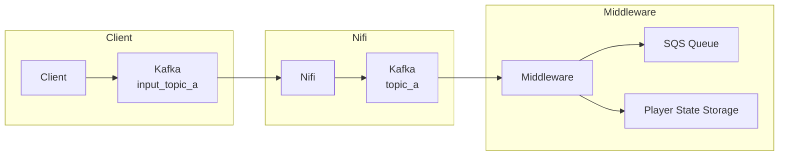
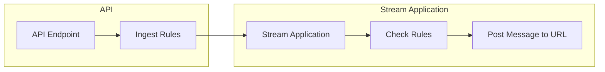
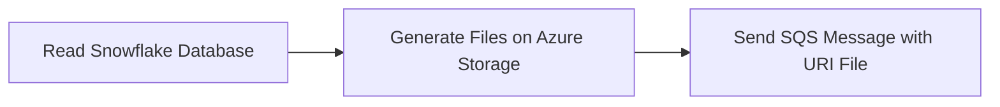

# Middleware

## General

The following tag are used on Azure resources:

- team: middleware
- client: list of our clients
- type:
  - kafka-to-sqs
  - checker
  - http-to-kafka
  - kafka-to-http
  - eventhub-to-sqs
  - snowflake-to-kafka
  - snowflake-to-sqs

## Why Middleware?

Middleware plays a crucial role in this system by acting as a bridge between various components and technologies. It enables seamless communication, data transformation, and integration, ultimately ensuring efficient and reliable processing of player state data. Key benefits of middleware include:

- **Decoupling:** Middleware decouples different components, allowing them to evolve independently without affecting the overall system.
- **Data Transformation:** It facilitates data transformation and enrichment, ensuring data compatibility between different systems.
- **Scalability:** Middleware can handle increased data volume and traffic, ensuring the system remains performant under load.
- **Error Handling and Resilience:** It can implement error handling and retry mechanisms to improve system reliability.
- **Deduplication:** By maintaining player state, middleware can prevent redundant messages from being sent to the SQS queue, ensuring data integrity and efficiency.

## Realtime: Streams (type:kafka-to-sqs, eventhub-to-sqs)



### kafka to symplify

- The application primarily listens to Kafka topics and forwards messages to an SQS queue.
- Most applications maintain player state in a persistent store, typically on Azure Storage.
- A punctuator component periodically generates files on Azure Storage and triggers events in the SQS queue.
- One specific application listens to Azure Event Hub and sends messages to the SQS queue.
- Some applications utilize Snowflake as a reference for country and currency data.

### Checker (type:checker, kafka-to-http, http-to-kafka)



- Client: soft2bet

This component comprises two parts:

- API: An endpoint that ingests deposit rules for a specific player ID along with a target URL.
- Stream Application: This application evaluates the rules and posts messages to the specified URL.

### Development

The applications use Quarkus framework.

### Deploy

#### Terraform

The deployment of the infrastructure is managed by Terraform. The main configuration is located in `clients/deployment/main.tf`. Each client has its own `terraform.tfvars` file in its corresponding directory (e.g., `clients/slotbox/terraform.tfvars`).

To deploy the infrastructure for a specific client, you need to run the following commands from the `clients/deployment` directory:

```sh
terraform init
terraform apply -var-file=../<client_name>/terraform.tfvars
```

The `container_apps` variable is a list of objects, where each object represents a container app. Each object has the following attributes:

- `name`: The name of the container app.
- `docker_image_name`: The name of the Docker image.
- `docker_image_tag`: The tag of the Docker image.
- `storage_share_name`: The name of the storage share to be used by the container app.

The `storage_configs` variable is a map of objects, where each key is the name of the storage share and each object has the following attributes:

- `quota`: The quota of the storage share in GB.

#### Generate the image

```sh
./package.sh pom.xml [registry]
```

#### Web app configuration

##### Network

[kafka] We have to use a subnet connected to kafka.
There is a constraint on the service plan which allowes only two subnets.

##### Storage

We configure Azure Storage for some applications to handle the state store.

##### Health Check

All applications contain a health check on `https://<web app default domain>/application/status`

##### Log

We configure `Diagnostic settings` to easily use the logs.
For cost issue, we disabled some applications the feature and use the classic one.

##### Alerts

We configure an alert on health check.

##### Auto-restart

We configure an auto-restart after 3 minutes in case of issue.

## Batch: Distributed Processing (type:snowflake-to-sqs,snowflake-to-kafka)



- The application reads snowflake database to generate a file on Azure Storage and sends an event in SQS qeue.
- The application reads snowflake database to push each line in kafka (ex: Load history)

### Development

The applications use Spark framework.

### Deploy

```sh
mvn clean package azure-functions:deploy -Pjada
```

#### Function app configuration

##### Network

[kafka] We have to use a subnet connected to kafka.
There is a constraint on the service plan which allowes only two subnets.

## Mapping sheets

- [link of links](https://docs.google.com/spreadsheets/d/1B5MKQjDsNe3JCh7stZPtM0ez6C2k-x4ap1j9FmFIAEI/edit?gid=0#gid=0)

## Troubleshoot

### Logs

We use:

- Azure Analytics Logs on the application
- Or `az webapp log download --name <app_name> --resource-group <group>`

### Known issue

We are facing issue on state store on Azure Storage.
A ticket has been opened on Azure.
Workaround:

- Restart the application
- Or change the state store path

### Command lines

#### Statuses

```sh
./bin/statuses.sh
```

#### Generate applications file

```
az webapp list --resource-group Soft2Bet --query "[?starts_with(tags.type, 'kafka-to')]" | jq -r '.[] | {app: .repositorySiteName, host: .defaultHostName, image: (.siteConfig.linuxFxVersion  | split("|")[1])}'
```
